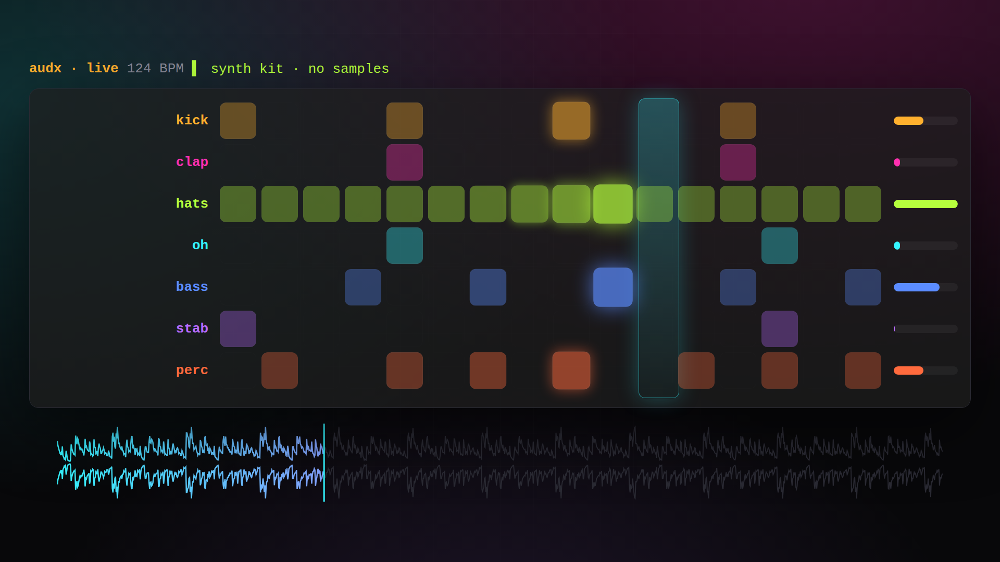
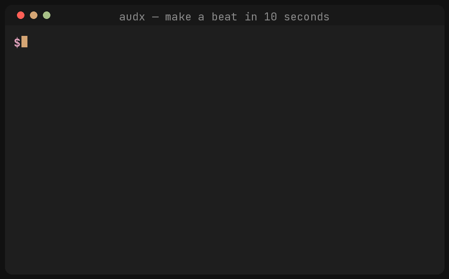

<div align="center">

# audx

**Code your music. Own your sound.**

A terminal-native digital audio workstation — pattern sequencing, a built-in
synth kit, stem mixing and live-coded playback, driven entirely from your
keyboard. Calm, local, hackable. No cloud, no mouse, no lock-in.

[](https://github.com/totalaudiopromo/audx/actions/workflows/ci.yml)
[](https://www.python.org/)
[](LICENSE)

<a href="marketing/promo/audx-promo.mp4"></a>

<sub>▶ the live synth sequencer · <a href="marketing/promo/audx-promo.mp4">watch the 20s promo</a></sub>

</div>

---

## Make a beat in 10 seconds

No samples. No audio hardware. No config.

```bash
pip install audx
audx demo loop.wav
```



> **No install? Play it in your browser** — the real pattern language + synth kit run
> client-side via Pyodide at [`/play.html`](site/play.html) on the landing page
> (live once GitHub Pages is enabled).

That writes a full multi-track beat — kick, sub, clap, hats, percussion — to
`loop.wav` using the **built-in synth kit**. Open it and you're listening to
audx. Then make your own:

```bash
audx render "kick 4/4"            -o kick.wav
audx render "cowbell e(5,16,2)"   -o bell.wav
audx render "hh 16x8 | swing 12%" -o hats.wav
```

Every instrument name (`kick`, `snare`, `hh`, `clap`, `cowbell`, `808`, …)
synthesizes automatically when no matching sample is found — so you make sound
the moment you install, and drop in your own audio whenever you want.

## What it is

audx is a real instrument you play from the terminal:

- **Pattern DSL** — `kick 4/4`, `hh 16x8`, `perc e(5,16,2)`, `clap [1.0.1.1]`
- **Built-in synth kit** — 20 procedurally-synthesised voices: drums, sub bass, plus melodic `bass`/`pluck`/`stab`/`keys`/`saw`/`sine`. Zero dependencies, zero samples.
- **Song arrangements** — multi-section tracks (intro/verse/drop/outro) rendered to one WAV
- **16-channel mixer** — gain, mute, pan and live level meters
- **Textual TUI** — mixer strips, transport, tap tempo, and live finger-drum pads
- **Offline rendering** — patterns and stems straight to WAV
- **MIDI** — export to Standard MIDI File, clock-out to gear, record MIDI in
- **Live-coding workflow** — `.audx` projects, slots, forks, hot-reload, diff

## What it isn't (yet)

Honest scaffolding, on the roadmap: true plugin **hosting** (discovery works
today), the Push 2 **screen** (pad **LEDs** work — see `audx jam`), a
production-grade shared audio daemon, and on-device voice control. These print
clear "not wired up yet" messages rather than pretending.

## Install

```bash
# with uv (recommended for hacking on audx)
uv sync
uv run audx demo loop.wav

# or as a tool / into your environment
pip install audx
audx demo loop.wav
```

**Offline features need no system libraries.** Rendering, MIDI export, project
diffing and `audx demo` are pure Python + numpy. Only *live* real-time playback
(`audx play`, the live TUI) needs PortAudio:

```bash
# macOS
brew install portaudio
# Debian / Ubuntu
sudo apt install libportaudio2
```

## Pattern DSL

```bash
audx pattern create kick  "kick 4/4"                       # four on the floor
audx pattern create snare "snare 2/8"                      # beats 2 and 4
audx pattern create hats  "hh 16x8 | vel 0.45 | channel 2" # 8 hats over 16 steps
audx pattern create perc  "perc e(5,16,2)"                 # Euclidean, rotated
audx pattern create clap  "clap [1.0.1.0.1.1.0.0]"         # explicit grid
audx pattern create groove "x--- -x-- --x- ---x"           # x/rest grid
```

**Base rhythms:** `inst 4/4` · `inst 16x8` · `inst e(hits,steps[,rotate])` ·
`inst [1.0.1.0]` · `x--- -x--` grids.

**Pipe modifiers** (`base | op arg | op arg …`):

| op | meaning | example |
|----|---------|---------|
| `vel` / `velocity` | level 0.0–1.0 | `hh 16x8 \| vel 0.45` |
| `channel` / `ch` | mixer channel | `snare 2/8 \| ch 2` |
| `swing` | delay odd 16ths | `hh 16x8 \| swing 50%` |
| `humanize` | velocity jitter | `kick 4/4 \| humanize 8%` |
| `chance` | per-step probability | `perc e(5,16) \| chance 70%` |
| `gain` | ±dB on the track | `kick 4/4 \| gain -3db` |
| `pan` | L100..R100 or -1..1 | `clap 2/8 \| pan L50` |
| `tune` | ±semitones | `sub e(3,8) \| tune -5st` |

See [docs/pattern-language.md](docs/pattern-language.md) and
[docs/synth-kit.md](docs/synth-kit.md) for the full reference.

## Songs

Arrange patterns into a multi-section track and render it to one WAV. A song is
a small JSON spec — sections of patterns, and the order they play:

```json
{
  "bpm": 124,
  "sections": {
    "intro": {"patterns": ["hh 16x8 | swing 12%", "sub e(3,8) | tune -5st"], "bars": 4},
    "drop":  {"patterns": ["kick 4/4", "clap 2/8", "bass e(5,16) | tune -7st"], "bars": 8},
    "outro": {"patterns": ["hh 16x8 | vel 0.4"], "bars": 4}
  },
  "sequence": ["intro", "drop", "drop", "outro"]
}
```

```bash
audx song info  track.json     # resolved timeline: section → start bar
audx song render track.json -o track.wav
```

## Play it live

Plug in a **MIDI controller or Push 2** and play the synth kit in real time —
hit a pad, hear a sound, no samples or setup:

```bash
audx midi list          # check your controller is detected
audx jam                # drum pads → kick/snare/hat/... (every pad makes a sound)
audx jam --chromatic --voice bass   # play a bassline across the keys
```

No controller? Finger-drum from the **computer keyboard** in the TUI — keys
`w e r a s d f z x c` trigger kick/snare/clap/hats/etc on their own channels:

```bash
audx open my-track
```

Full walkthrough (kids included): [docs/playing-live.md](docs/playing-live.md).

## Command overview

| Area | Commands |
|------|----------|
| **Make sound** | `demo` · `render` · `synths` · `jam` · `play` · `stop` |
| **Songs** | `song render <spec.json>` · `song info <spec.json>` |
| **Patterns / tracks** | `pattern create\|list\|delete` · `track add\|rm` |
| **Mixing** | `mix set <ch> gain\|mute` · `mute <ch>` |
| **Samples / stems** | `samples index` · `stems search` · `samples list` |
| **Projects** | `init` · `open` · `save` · `load` · `projects list` · `fork` · `diff` · `watch` |
| **Slots & macros** | `slot set\|next\|list` · `macro record\|replay\|list` |
| **MIDI** | `export midi` · `midi out\|rec\|list` |
| **AI (optional extras)** | `ai pattern\|similar\|tag\|groove\|key` |
| **Bridges** | `plugins scan` · `push2 map\|lights` · `heartmula` · `sadact` · `daemon` |
| **Live dashboard** | `serve` · `open --serve` (host it from the TUI) |
| **Diagnostics** | `doctor` · `version` |

Run `audx --help` or `audx <command> --help` for details.

## Project files

`audx init my-loop` lays out:

```
my-loop/
  project.audx     # JSON: bpm, patterns, slots, mixer, finisher config
  stems/           # your WAV/AIFF source material (optional — synth kit is built in)
  renders/         # rendered output (gitignored)
  .git/            # optional, created by default
```

Projects carry a `[finisher]` block that maps 1:1 to the `sadact-finisher` CLI
(`profile`, `platform`, `loudness`, `use_stems`, …); `audx finish` drives the
mastering pass.

## Development

```bash
uv sync
uv run pytest -q                 # 120+ tests
uv run ruff check src tests
uv run mypy src/audx             # clean across the whole package
```

See [CONTRIBUTING.md](CONTRIBUTING.md) for the quality bar and how the DSL and
synth kit are structured.

## Philosophy

> Code is the controller. Sound is the canvas. Terminal is the dimension.

The bar for audx is not "does a test pass?" The bar is: can you open a terminal,
hit play, and feel like you're controlling a musical instrument rather than
debugging Python.

## License

MIT © Chris Schofield — see [LICENSE](LICENSE).
